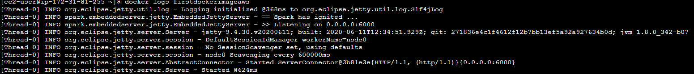

# Parcial

## Descripción del proyecto
Este es un aplicativo web usando los estandares de api rest mediante el microframework de spark
tiene como objetivo permitir al usuario ingresar un número y posteriormente se le mostrará
en pantalla un JSON el contiene la secuencia de salida de la conjetura de collatz.

## Software necesarias
- maven
- Java
- Git
- Docker

## Despliegue del proyecto

Para clonar el proyecto utilice el siguiente comando:
```
git clone https://github.com/Derjasai/parcial2AREP.git
```
Una vez descargado acceda a la carpeta y corra el siguiente comando
```
mvn clean install
```
Este comando compilará las clases Java y creara una carpeta de dependencias dentro del targe.

Finalmente para desplegar el proyecto de forma local use el siguiente comando (si usa un sistema operativo linux rremplace el ; por un :)
```
java -cp "target/classes;target/dependency/*" edu.eci.arep.app.Spark
```

## Despliegue en la nube
Una vez se tenga la instancia de una máquina EC2 en la nube, se tiene que habilitar el
puerto 34000 para que pueda escuchar por este mismo. seguido a esto instale doccker en su máquina
corra los siguientes comandos:
```
sudo yum update -y
sudo yum install docker
sudo service docker start
```
Una vez instalado docker corra el siguiente comando para descargar el contenedor que
tiene el aplicativo

```
docker run -d -p 34000:6000 --name firstdockerimageaws derjasai/dockersparkparcial1
```

Seguido a esto realice el siguiente comando y deberá tener una imagen como esta:
````
docker ps
````


Finalmente ingrese a la ip de su maquina, si quiere comprobar el funcionamiento del aplicativo
realice 

````
docker logs docker logs firstdockerimageaws
````

y deberá obtener una imagen como esta:


## Pruebas de funcionamiento
Como podernos fijarnos en esta primera imagen es el ejemplo del usuario ingresando al 
aplicativo y haciendo la consulta de un número


En este segundo ejemplo se usa un número mas grande para realizar la consulta, como se
puede ver se usa el mismo url, dando como resultado que el código se ejecuta en un servidor


## Autor
Daniel Esteban Ramos Jimenéz